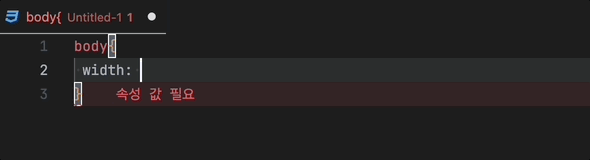

# Forbiz REM Calculator

모바일 환경 작업 시 px값에 2를 곱해 rem으로 자동 변환 해줍니다.

# 사용법

-   Windows: `Alt + R`
-   MacOS: `Cmd + R`
-   단축키 실행 후 px값 입력 후 엔터 (px를 제외한 숫자만 입력)

# Extension 다운로드

[다운로드](./forbiz-rem-calculator-0.1.0.vsix)

# Repository

[REM Calculator](https://github.com/JunTaeHahm/rem-calculator)
